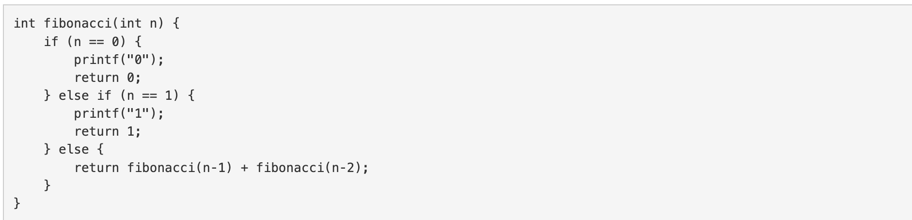
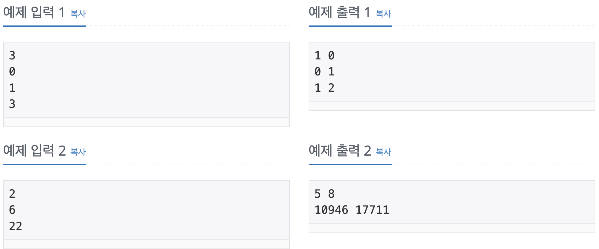

Problem
=======
다음 소스는 N번째 피보나치 수를 구하는 C++ 함수이다.

</img>

fibonacci(3)을 호출하면 다음과 같은 일이 일어난다.

* fibonacci(3)은 fibonacci(2)와 fibonacci(1) (첫 번째 호출)을 호출한다.
* fibonacci(2)는 fibonacci(1) (두 번째 호출)과 fibonacci(0)을 호출한다.
* 두 번째 호출한 fibonacci(1)은 1을 출력하고 1을 리턴한다.
* fibonacci(0)은 0을 출력하고, 0을 리턴한다.
* fibonacci(2)는 fibonacci(1)과 fibonacci(0)의 결과를 얻고, 1을 리턴한다.
* 첫 번째 호출한 fibonacci(1)은 1을 출력하고, 1을 리턴한다.
* fibonacci(3)은 fibonacci(2)와 fibonacci(1)의 결과를 얻고, 2를 리턴한다.
* 1은 2번 출력되고, 0은 1번 출력된다. N이 주어졌을 때, fibonacci(N)을 호출했을 때, 0과 1이 각각 몇 번 출력되는지 구하는 프로그램을 작성하시오.

Input
======
첫째 줄에 테스트 케이스의 개수 T가 주어진다.

각 테스트 케이스는 한 줄로 이루어져 있고, N이 주어진다. N은 40보다 작거나 같은 자연수 또는 0이다.

Output
======
각 테스트 케이스마다 0이 출력되는 횟수와 1이 출력되는 횟수를 공백으로 구분해서 출력한다.

Examples
======
</img>

Source
======
[Source Link](https://www.acmicpc.net/problem/1003)