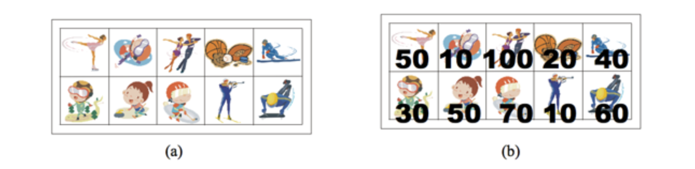

PROBLEM
======
Sanguen's little sister, Sangnyang, bought 2n stickers from a stationery store. The stickers are arranged in 2 rows and n columns, as shown in picture (a). Sangnyang plans to decorate her desk using the stickers.
 
The stickers that Sangnyang bought are of very poor quality. When a sticker is removed, any stickers sharing a side with it will tear and become unusable. Any stickers sharing a side with it-on the left, right, above, or below-will tear and become unusable.

Unable to use all the stickers, Sangnyang assigns a score to each sticker tries to remove them in a way that maximizes the total score. First, a score is assigned to each sticker, as shown in picture (b). Write a program to calculate the maximum total score that Sangnyang can achieve by removing the stickers. So, you need to find a set of stickers from the 2n stickers that maximizes the total score while ensuring that no two stickers share an edge.
 
In the case of the picture above, selecting the stickers with scores of 50, 50, 100 and 60 results in a total score of 260, which is the maximum score. The two stickers with the highest score, 100 and 70, can't be removed at the same time because they share an edge.

INPUT
======
The first line contains the numberr of test cases, T. For each test case, the first line contains the value of n(1 ≤ n ≤ 100,000). The next two lines contain n integers, each representing the score of the sticker at that position. There is one empty space between two consecutive integers. The score is an integer that is greater than or equal to 0 and less than or equal to 100.

OUTPUT
======
For each test case, print the maximum total score achievable by selecting stickers from the 2n stickers, ensuring that no two stickers share an edge.

SOURCE LINK
======
https://www.acmicpc.net/problem/9465
