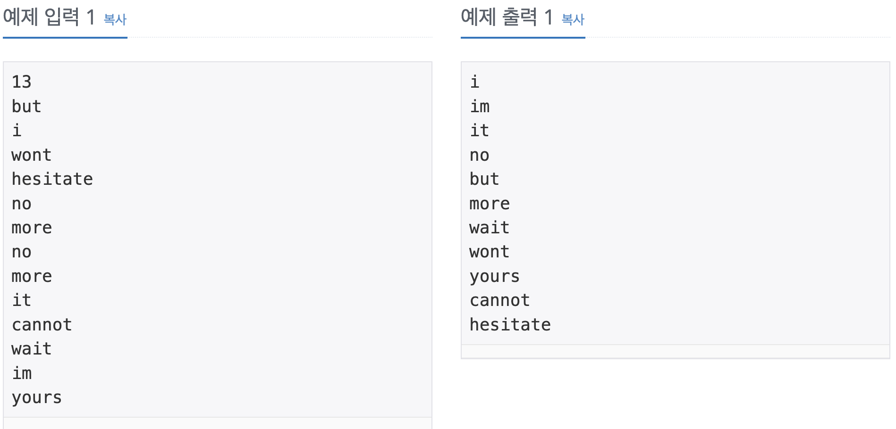

Problem
=======
알파벳 소문자로 이루어진 N개의 단어가 들어오면 아래와 같은 조건에 따라 정렬하는 프로그램을 작성하시오.

1. 길이가 짧은 것부터
2. 길이가 같으면 사전 순으로

단, 중복된 단어는 하나만 남기고 제거해야 한다.

Input
======
첫째 줄에 단어의 개수 N이 주어진다. (1 ≤ N ≤ 20,000) 둘째 줄부터 N개의 줄에 걸쳐 알파벳 소문자로 이루어진 단어가 한 줄에 하나씩 주어진다. 주어지는 문자열의 길이는 50을 넘지 않는다.

Output
======
조건에 따라 정렬하여 단어들을 출력한다.

Examples
======
</img>

Source
======
[Source Link](https://www.acmicpc.net/problem/1181)