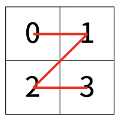
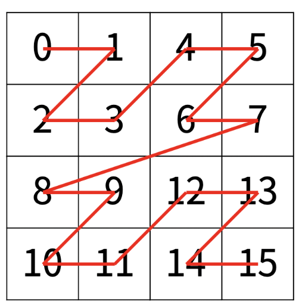
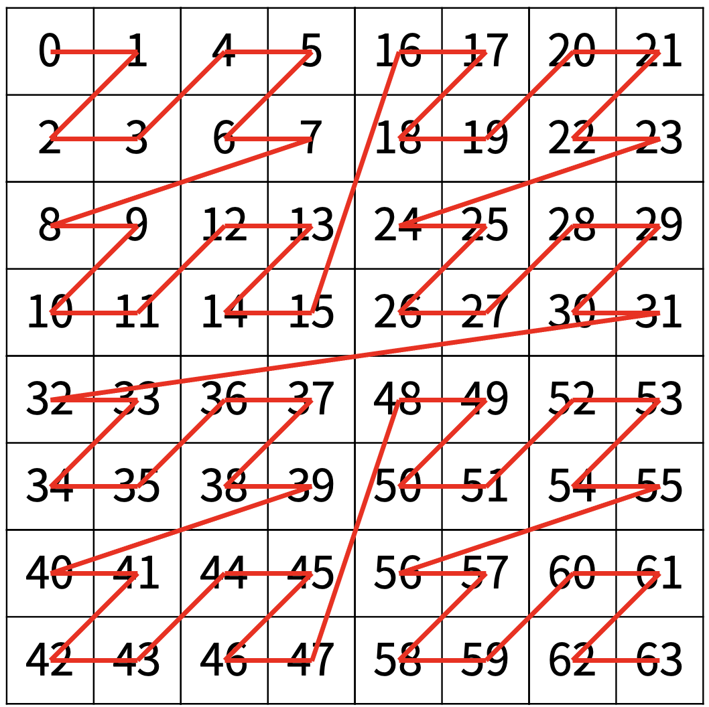
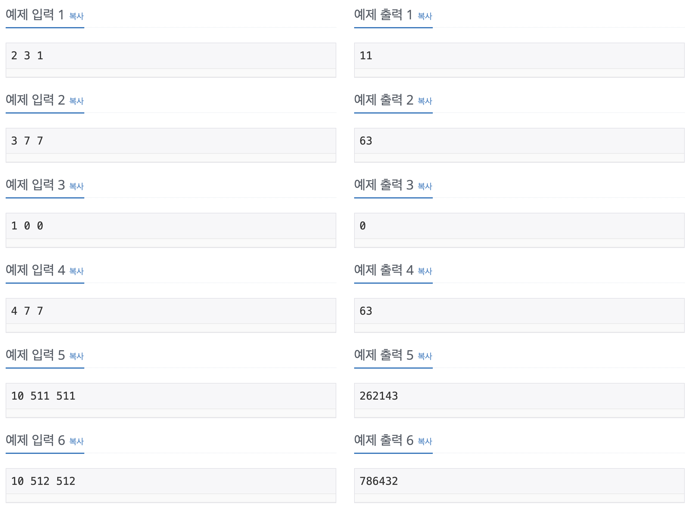

Problem
=======
한수는 크기가 2^N × 2^N인 2차원 배열을 Z모양으로 탐색하려고 한다. 예를 들어, 2×2배열을 왼쪽 위칸, 오른쪽 위칸, 왼쪽 아래칸, 오른쪽 아래칸 순서대로 방문하면 Z모양이다.

</img>

N > 1인 경우, 배열을 크기가 2^(N-1) × 2^(N-1)로 4등분 한 후에 재귀적으로 순서대로 방문한다.

다음 예는 2^2 × 2^2 크기의 배열을 방문한 순서이다.

</img>

N이 주어졌을 때, r행 c열을 몇 번째로 방문하는지 출력하는 프로그램을 작성하시오.

다음은 N=3일 때의 예이다.

</img>

Input
======
첫째 줄에 정수 N, r, c가 주어진다.

Output
======
r행 c열을 몇 번째로 방문했는지 출력한다.

Restrictions
======
* 1 ≤ N ≤ 15
* 0 ≤ r, c < 2N

Examples
======
</img>

Source
======
[Source Link](https://www.acmicpc.net/problem/1074)