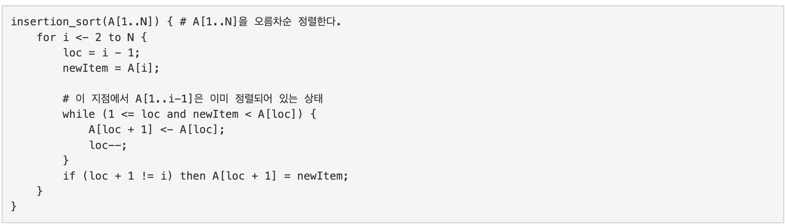
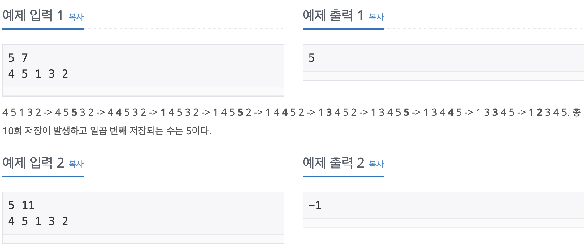

Problem
=======
오늘도 서준이는 삽입 정렬 수업 조교를 하고 있다. 아빠가 수업한 내용을 학생들이 잘 이해했는지 문제를 통해서 확인해보자.

N개의 서로 다른 양의 정수가 저장된 배열 A가 있다. 삽입 정렬로 배열 A를 오름차순 정렬할 경우 배열 A에 K 번째 저장되는 수를 구해서 우리 서준이를 도와주자.

크기가 N인 배열에 대한 삽입 정렬 의사 코드는 다음과 같다.

</img>

Input
======
첫째 줄에 배열 A의 크기 N(5 ≤ N ≤ 10,000), 저장 횟수 K(1 ≤ K ≤ N2)가 주어진다.

다음 줄에 서로 다른 배열 A의 원소 A1, A2, ..., AN이 주어진다. (1 ≤ Ai ≤ 109)

Output
======
K 번째 저장 되는 수를 출력한다. 저장 횟수가 K 보다 작으면 -1을 출력한다.

Examples
======
</img>