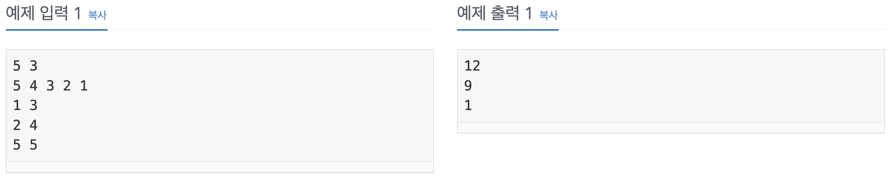

Problem
=======
수 N개가 주어졌을 때, i번째 수부터 j번째 수까지 합을 구하는 프로그램을 작성하시오.

Input
======
첫째 줄에 수의 개수 N과 합을 구해야 하는 횟수 M이 주어진다. 둘째 줄에는 N개의 수가 주어진다. 수는 1,000보다 작거나 같은 자연수이다. 셋째 줄부터 M개의 줄에는 합을 구해야 하는 구간 i와 j가 주어진다.

Output
======
총 M개의 줄에 입력으로 주어진 i번째 수부터 j번째 수까지 합을 출력한다.

Restrictions
======
* 1 ≤ N ≤ 100,000
* 1 ≤ M ≤ 100,000
* 1 ≤ i ≤ j ≤ N

Examples
======
</img>

Source
======
[Source Link](https://www.acmicpc.net/problem/11659)