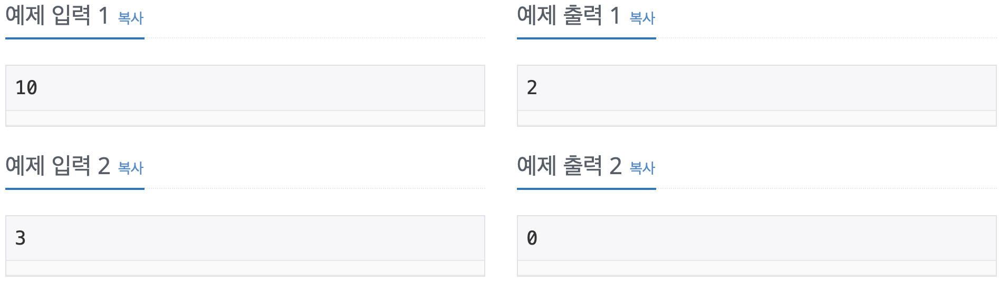

Problem
=======
N!에서 뒤에서부터 처음 0이 아닌 숫자가 나올 때까지 0의 개수를 구하는 프로그램을 작성하시오.

Input
======
첫째 줄에 N이 주어진다. (0 ≤ N ≤ 500)

Output
======
첫째 줄에 구한 0의 개수를 출력한다.

Examples
======
</img>

Source
======
[Source Link](https://www.acmicpc.net/problem/1676)