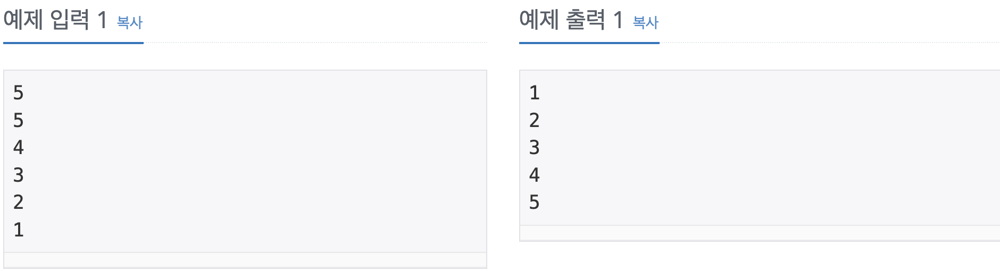

Problem
=======
N개의 수가 주어졌을 때, 이를 오름차순으로 정렬하는 프로그램을 작성하시오.

Input
======
첫째 줄에 수의 개수 N(1 ≤ N ≤ 1,000,000)이 주어진다. 둘째 줄부터 N개의 줄에는 수가 주어진다. 이 수는 절댓값이 1,000,000보다 작거나 같은 정수이다. 수는 중복되지 않는다.

Output
======
첫째 줄부터 N개의 줄에 오름차순으로 정렬한 결과를 한 줄에 하나씩 출력한다.

Examples
======
</img>

Source
======
[Source Link](https://www.acmicpc.net/problem/2751)